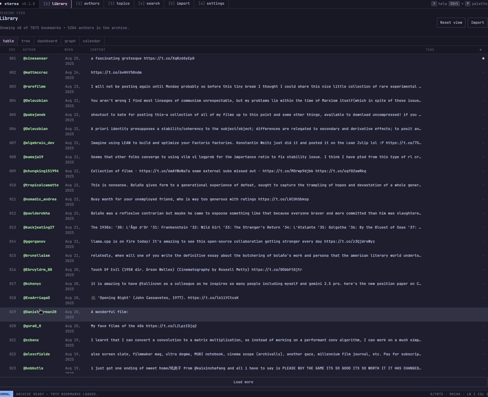
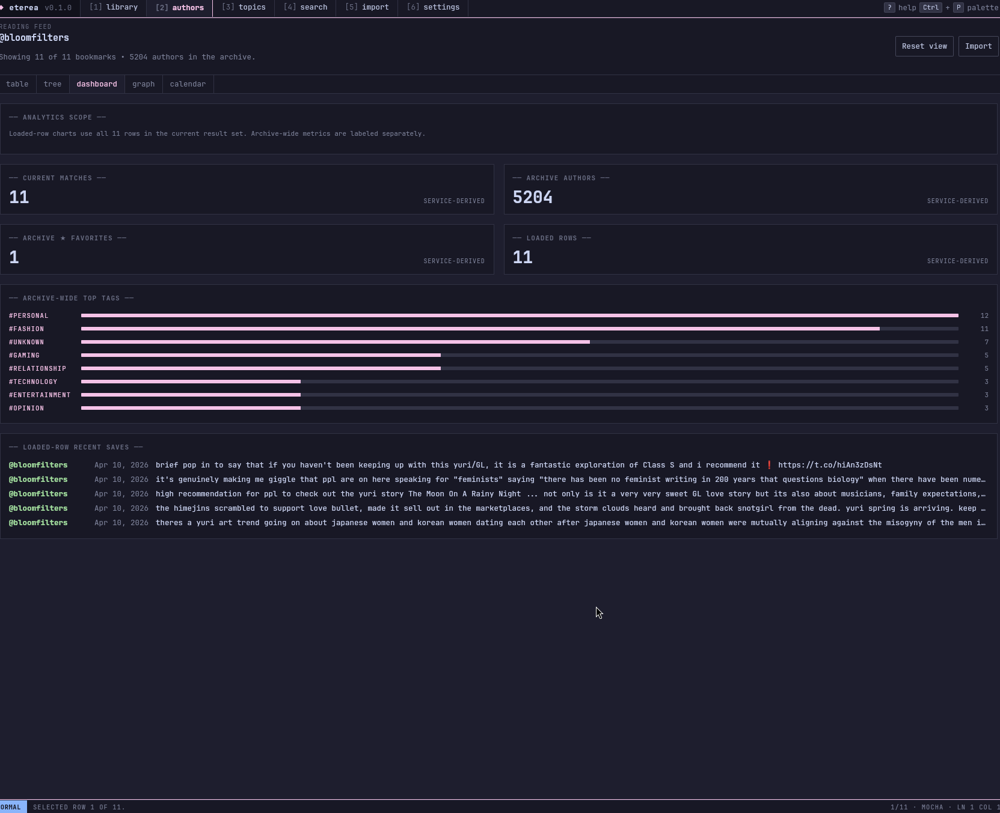

# Eterea

Eterea is a quiet, local-first reading room for X/Twitter bookmarks. Import an
export, keep it in SQLite on your own machine, then browse it through a fast
keyboard-friendly Dioxus desktop app.

It is built for people who save too much and want the archive to feel useful
again: search it, slice it by author or topic, favorite things, inspect media
only when you ask for it, and move through the library without a browser tab
trying to become another inbox.

<p align="center">
  
  
</p>

Status: [CI](https://github.com/Meillaya/eterea/actions/workflows/ci.yml) · [MIT License](LICENSE) · [Rust workspace](Cargo.toml) · [Dioxus UI](src/dioxus-app/) · [privacy: local-first](#privacy-model)

## What it does

- Imports CSV, JSON, and X archive JavaScript bookmark exports.
- Previews an import before it writes anything.
- Stores everything locally in SQLite under the platform app-data directory.
- Searches text and filters by author, topic, date, media, and favorites.
- Offers terminal-style library views: table, tree, dashboard, graph, and calendar.
- Opens entry detail, author, topic, search, import, and settings routes from the same desktop shell.
- Keeps remote tweet images hidden by default; load media per tweet or for the current session only.
- Stores media metadata such as alt text, dimensions, source type, preview URL, and variants when exports include it; it does not cache media bytes.

## Privacy model

Eterea does not sync with X, phone home, or run a background companion service.
Imported bookmark data stays on your machine. Text is rendered as text, not raw
HTML. Stored media URLs are treated cautiously: previews are hidden unless you
explicitly load one tweet or enable all images for the current session, and
external opening is limited to explicit HTTPS user actions. Eterea stores
metadata-only media fields from imports (alt text, dimensions, source keys,
preview URLs, and variants) so the UI can label and reserve layout space, but it
does not download media in the background or persist media bytes.

## Quick start

The easiest supported development path is Nix, because the desktop app needs a
few native system libraries.

```bash
nix develop
nix develop -c cargo run -p eterea-dioxus
```

Plain `cargo run -p eterea-dioxus` can work on machines that already have the
native desktop dependencies installed, but Nix is the reproducible path.

## Verify before shipping

```bash
nix develop -c cargo fmt --all -- --check
nix develop -c cargo clippy --workspace --all-targets -- -D warnings
nix develop -c cargo test --workspace
nix develop -c cargo build -p eterea-dioxus --release
python scripts/check-doc-links.py README.md 'docs/**/*.md'
```

CI runs the Rust gates. The docs-link checker is still a local release check.

## Project map

- `src/backend/` — storage, ingestion, search, stats, and migrations.
- `src/app/` — application service layer used by the desktop UI and tests.
- `src/dioxus-app/` — Dioxus desktop shell and UI.
- `docs/` — architecture, workflow, design-system, preview, and release notes.
- `fixtures/` — local test fixtures for import and guardrail coverage.

## Documentation

- [Documentation index](docs/README.md)
- [Architecture](docs/architecture.md)
- [Development workflow](docs/development.md)
- [Design system](docs/design-system.md)
- [Preview asset notes](docs/assets/previews/README.md)
- [Release readiness](docs/operations/release-readiness.md)

## License

MIT. See [LICENSE](LICENSE).
